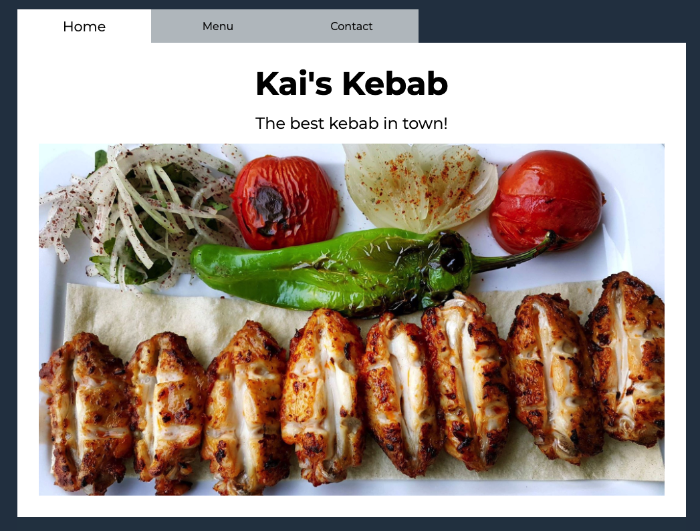

# Restaurant Page
Restaurant page created with HTML, CSS & Javascript for The Odin Project.

## Demo
Here is a working live demo: https://kapaha.github.io/restaurant-page/

## General info
This project was created as a part of the [Javascript](https://www.theodinproject.com/courses/javascript/lessons/restaurant-page) course with [The Odin Project](https://theodinproject.com). The aim of this project was to solidate the knowledge I have learnt about ES6 modules and DOM manipulation.

## Features
* Tabbed browsing
* Dynamically rendered
* Javascript styles and media queries

## Built with
* HTML
* CSS
* Javascript

## Status
The project is finished, however I may continue to improve on it as my knowledge of web development improves.